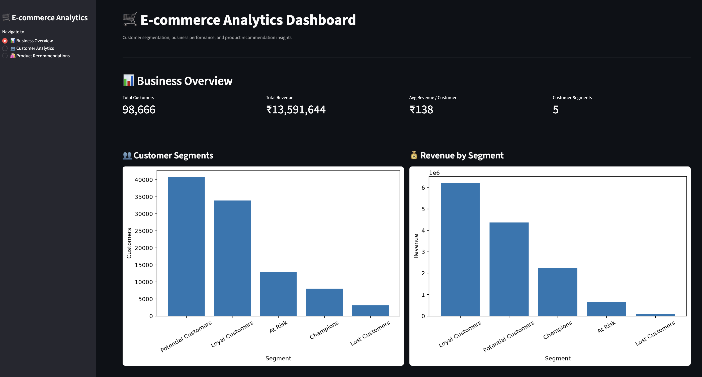
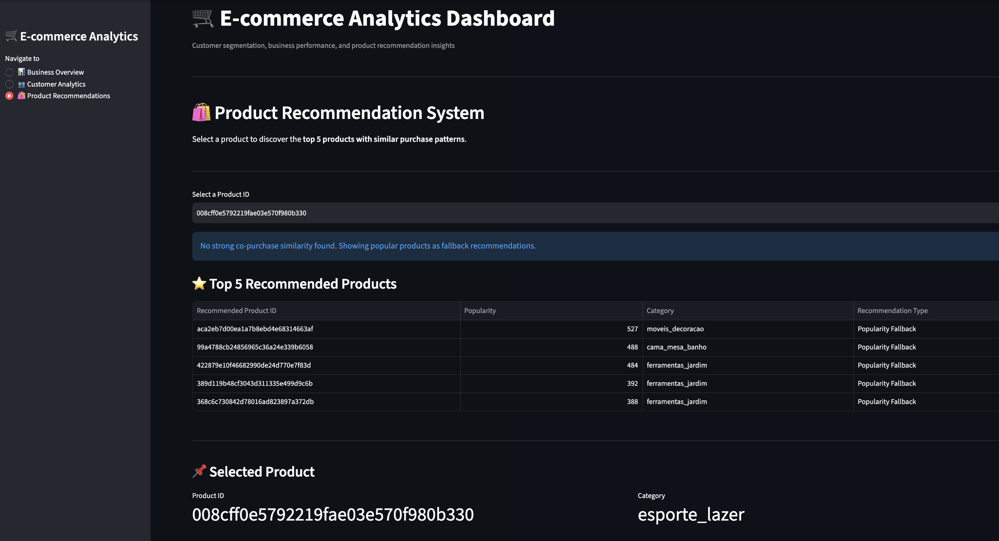

# E-commerce Customer Analytics & Product Recommendation System

An end-to-end e-commerce analytics project built using Python and Streamlit to analyze customer purchasing behavior, perform RFM-based customer segmentation, and provide product recommendations based on purchase patterns.

The project combines customer analytics, business performance insights, and a product recommendation system into an interactive dashboard.

---

## Project Overview

This project focuses on three major areas:

- Customer segmentation using RFM analysis
- Business and revenue analysis
- Product recommendation using purchase-based similarity

An interactive Streamlit dashboard was developed to bring these insights together in one interface.

---

## Methodology

### 1. Data Cleaning & Preprocessing

Multiple datasets from the Brazilian E-commerce (Olist) dataset were cleaned and integrated, including:

- Customers
- Orders
- Order Items
- Products
- Payments
- Reviews
- Sellers
- Product Categories

The datasets were merged to create an integrated view of customer purchases and product information.

---

### 2. Customer Segmentation using RFM Analysis

Customer purchasing behavior was analyzed using RFM analysis.

**Recency**
- Number of days since the customer's most recent purchase

**Frequency**
- Number of orders placed by the customer

**Monetary**
- Total product purchase value

Customers were assigned RFM scores from 1 to 5 and grouped into five business-oriented segments:

- Champions
- Loyal Customers
- Potential Customers
- At Risk
- Lost Customers

---

### 3. Product Recommendation System

A customer-product interaction matrix was created using historical purchase data.

To keep the recommendation pipeline memory-efficient, the analysis focused on the top 1,000 products based on purchase frequency.

Cosine similarity was calculated between products to identify products with similar purchase patterns.

For a selected product, the system generates the top 5 similar products.

A popularity-based fallback is also used when sufficient similarity information is not available.

---

### 4. Recommendation Evaluation

The recommendation system was evaluated using:

- Precision@5
- Recall@5

The current baseline evaluation achieved:

- **Precision@5: 0.0294**
- **Recall@5: 0.1469**
- **Evaluated Customers: 497**

These metrics provide a baseline assessment of recommendation relevance rather than conventional classification accuracy.

---

## Dashboard

An interactive Streamlit dashboard was developed with three sections:

### 📊 Business Overview

- Total Customers
- Total Revenue
- Average Revenue per Customer
- Customer Segments
- Customer segment distribution
- Revenue contribution by customer segment

### 👥 Customer Analytics

- RFM-based customer segmentation
- Segment filtering
- Segment-level revenue analysis
- Customer-level RFM information

### 🛍️ Product Recommendations

- Product selection
- Top 5 similar products
- Similarity scores
- Product categories
- Popularity-based fallback recommendations

---

## Dashboard Preview

### Business Overview



### Product Recommendations



---

## Key Results

- **98,666 customers** analyzed
- **₹13.59M** total product purchase value analyzed
- **₹138** average revenue per customer
- **5** RFM-based customer segments
- **1,000-product** similarity matrix
- Top-5 product recommendation system implemented
- Recommendation evaluation performed using Precision@5 and Recall@5
- Interactive Streamlit dashboard developed for analytics and recommendations

---

## Technologies Used

- Python
- Pandas
- NumPy
- Matplotlib
- Seaborn
- Scikit-learn
- Streamlit
- Jupyter Notebook

---

## Project Structure

```text
E-commerce-Insights-Product-Recommender/
│
├── app.py
├── e-commerce-insights-product-recommender.ipynb
├── requirements.txt
├── README.md
├── .gitignore
│
├── images/
│   ├── business_overview.png
│   └── product_recommendations.png
│
└── data/
    ├── raw/
    │
    └── processed/
        ├── customer_rfm_segments.csv
        ├── customer_segment_analysis.csv
        ├── product_similarity_matrix.csv
        └── sample_product_recommendations.csv